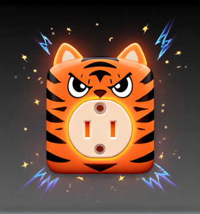

# 🐅⚡ TigerRozetka - Telegram Mini App Game

**Русское название: "Тигррозетка"**

Многопользовательская игра-рулетка для Telegram Mini Apps с элементами социального взаимодействия, коллекционирования и стратегии. Игроки участвуют в "опасной" игре с электричеством в безопасной игровой среде.



## 🎮 Single Mode - Первая реализация

В первой версии реализован **Single Mode** - тренировочный режим для новых игроков:

- **Игрок управляет смельчаком**, нажимая на розетку `tigrrozetka5.png`
- **ИИ-Электрик** автоматически управляет подачей тока с различными паттернами
- **Цель**: Набрать максимальное количество вольт за ограниченное время
- **Программные эффекты искр** при каждом нажатии
- **Система начисления очков** с учетом риска и серий

### 🎯 Игровые механики

#### Система начисления очков
- **Базовые очки**: 10⚡ за выживание
- **Множители риска**: 
  - Низкий риск: x1.0
  - Средний риск: x1.5  
  - Высокий риск: x2.0
  - Экстремальный риск: x3.0
- **Серийные бонусы**: x1.2-x3.0 за непрерывные серии (5-50 нажатий)
- **Утешительный приз**: 8-25⚡ за поражение током

#### Уровни сложности
1. **Лёгкий**: 15% шанс разряда, 2 сек предупреждение
2. **Средний**: 25% шанс разряда, 1.5 сек предупреждение  
3. **Сложный**: 35% шанс разряда, 1 сек предупреждение
4. **Экстрим**: 50% шанс разряда, 0.5 сек предупреждение

#### Достижения
- **Первое прикосновение**: Нажми на розетку впервые (+50⚡)
- **Живчик**: Серия из 5 успешных нажатий (+100⚡)
- **Везунчик**: Серия из 10 успешных нажатий (+250⚡)
- **Безрассудный**: 50 нажатий в режиме High Risk (+500⚡)
- **Выживальщик**: Выживи 5 минут без поражения (+1000⚡)

## 🚀 Быстрый старт

### Требования
- Node.js 18+
- npm или yarn
- Современный браузер с поддержкой WebGL

### Установка

1. **Клонируйте репозиторий**
```bash
git clone git@github.com:orspiritus/tigerrosette.git
cd TigerRozetka
```

2. **Установите зависимости**
```bash
npm install
```

3. **Запустите в режиме разработки**
```bash
npm run dev
```

4. **Откройте в браузере**
```
http://localhost:3000
```

### Сборка для продакшена
```bash
npm run build
npm run preview
```

## 🎨 Технологический стек

### Frontend
- **React 18** + **TypeScript** + **Vite**
- **Tailwind CSS** для стилизации
- **Framer Motion** для анимаций
- **Zustand** для управления состоянием
- **Web Audio API** для звуковых эффектов

### Интеграция с Telegram
- **Telegram Mini Apps SDK** для интеграции с Telegram
- **Telegram WebApp API** для доступа к функциям мессенджера
- Поддержка **Telegram Stars** для монетизации

## 🎮 Как играть

### Одиночный режим (Single Mode)

1. **Выберите сложность** в главном меню
2. **Нажимайте на розетку** для получения очков
3. **Следите за предупреждениями** ИИ-Электрика
4. **Избегайте разрядов** или получайте утешительные призы
5. **Стройте серии** для получения бонусов
6. **Набирайте вольты** для покупки улучшений

### Система риска
- **Зелёный (Низкий)**: Безопасное время для нажатия
- **Жёлтый (Средний)**: Умеренный риск, средние бонусы
- **Оранжевый (Высокий)**: Опасно, но выгодно
- **Красный (Экстрим)**: Максимальный риск и награды

## 🔧 Структура проекта

```
TigerRozetka/
├── Media/Pictures/          # Игровые изображения
│   └── tigrrozetka5.png    # Основная розетка-кнопка
├── src/
│   ├── components/         # React компоненты
│   │   ├── TigerOutlet.tsx # Главная игровая кнопка
│   │   ├── GameHUD.tsx     # Игровой интерфейс
│   │   ├── MainMenu.tsx    # Главное меню
│   │   └── GameScreen.tsx  # Игровой экран
│   ├── store/              # Zustand хранилища
│   │   └── gameStore.ts    # Основное состояние игры
│   ├── types/              # TypeScript типы
│   │   └── game.ts         # Игровые интерфейсы
│   ├── utils/              # Утилиты
│   │   └── soundManager.ts # Управление звуком
│   ├── App.tsx             # Главный компонент
│   ├── main.tsx           # Точка входа
│   └── index.css          # Основные стили
├── package.json
├── vite.config.ts
├── tailwind.config.js
└── README.md
```

## 🎵 Звуковые эффекты

Игра использует **Web Audio API** для программной генерации звуков:

- **Искры**: Процедурно генерируемые звуки разной интенсивности
- **Разряды**: Низкочастотные звуки с шумом
- **Предупреждения**: Модулированные тональные сигналы
- **Успех**: Мелодичные звуки достижений

## 🚀 Roadmap

### Фаза 1: MVP ✅ (Завершено)
- [x] Базовая игровая механика
- [x] Single Mode
- [x] Система счёта
- [x] Эффекты искр
- [x] Звуковые эффекты

### Фаза 2: Расширения (В разработке)
- [ ] Многопользовательский режим
- [ ] Система электрических цепей
- [ ] Магазин предметов
- [ ] Достижения и прогрессия

### Фаза 3: Полная версия (Планируется)
- [ ] Турниры и события
- [ ] Telegram Stars интеграция
- [ ] Социальные функции
- [ ] Мобильная оптимизация

## 📱 Telegram Mini App

Для интеграции с Telegram:

1. **Создайте бота** через @BotFather
2. **Настройте Mini App** в настройках бота
3. **Укажите URL** вашего приложения
4. **Протестируйте** через веб-интерфейс Telegram

### Переменные окружения
```env
VITE_TELEGRAM_BOT_TOKEN=your_bot_token
VITE_TELEGRAM_WEBAPP_URL=https://your-domain.com
```

## 🎨 Кастомизация

### Изменение изображения розетки
1. Замените файл `Media/Pictures/tigrrozetka5.png`
2. Обновите размеры в `TigerOutlet.tsx` если необходимо
3. Настройте эффекты искр под новый дизайн

### Настройка сложности
Измените параметры в `GameScreen.tsx`:
```typescript
const config = {
  easy: { shockProbability: 0.15, warningTime: 2000 },
  // ... другие уровни
}
```

### Стилизация
Все стили настраиваются через `tailwind.config.js`:
```javascript
theme: {
  extend: {
    colors: {
      primary: { orange: '#FF6B35' },
      accent: { blue: '#00D4FF' }
    }
  }
}
```

## 🐛 Отладка

### Проблемы с аудио
```javascript
// Проверка поддержки Web Audio API
if (!window.AudioContext) {
  console.warn('Web Audio API не поддерживается');
}
```

### Проблемы с Telegram
```javascript
// Проверка доступности Telegram WebApp
if (!window.Telegram?.WebApp) {
  console.warn('Запуск вне Telegram');
}
```

## 📄 Лицензия

MIT License - см. файл [LICENSE](LICENSE)

## 🤝 Контрибьюция

1. Fork проекта
2. Создайте feature branch (`git checkout -b feature/AmazingFeature`)
3. Commit изменения (`git commit -m 'Add AmazingFeature'`)
4. Push в branch (`git push origin feature/AmazingFeature`)
5. Откройте Pull Request

## 📞 Поддержка

- **GitHub Issues**: [Создать issue](https://github.com/orspiritus/tigerrosette/issues)
- **Telegram**: @TigerRozetkaSupport
- **Email**: support@tigerrozetka.game

---

**⚡ Играй осторожно! ⚡**

*Версия 1.0.0 | Single Mode*
