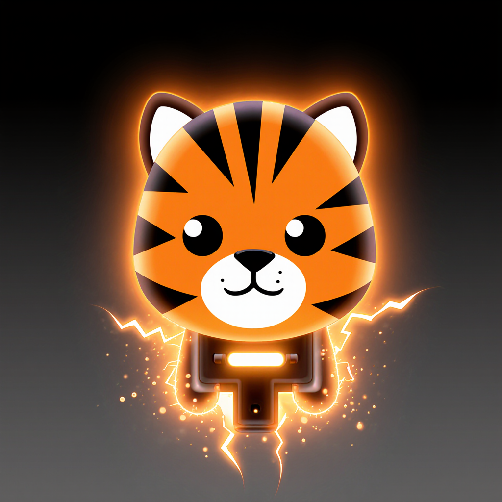

# 🐅⚡ TigerRozetka - Telegram Mini App



**TigerRozetka** - захватывающая игра-рулетка с электричеством для Telegram Mini Apps. Игроки участвуют в "опасной" игре с электричеством в безопасной игровой среде с тактическими элементами, системой уровней и прогрессией.

## 🎮 Особенности игры

- ⚡ **Уникальная механика** - баланс между риском и наградой
- 🏆 **Система прогрессии** - 20 уровней развития персонажа  
- 🎯 **Система достижений** - коллекционирование наград
- 🔊 **Haptic Feedback** - тактильная обратная связь через Telegram
- 🎨 **Современный дизайн** - адаптивный интерфейс
- 💾 **Автосохранение** - прогресс сохраняется автоматически

## 🚀 Быстрый старт

### Telegram Mini App
1. **Играть сейчас**: https://t.me/tigerrozetka_bot (когда бот настроен)
2. **Прямая ссылка**: https://orspiritus.github.io/tigerrosette/

### Локальная разработка
```bash
# Клонирование репозитория
git clone https://github.com/orspiritus/tigerrosette.git
cd tigerrosette

# Установка зависимостей
npm install

# Запуск в режиме разработки
npm run dev

# Билд для продакшена
npm run build

# Деплой на GitHub Pages
./deploy.ps1
```

## 🛠️ Технологии

### Frontend
- **React 18** + **TypeScript** - современный и типобезопасный фронтенд
- **Framer Motion** - плавные анимации и переходы
- **Zustand** - легковесное управление состоянием
- **Tailwind CSS** - утилитарная стилизация
- **Vite** - быстрая сборка и hot-reload

### Telegram Integration
- **@telegram-apps/sdk** - официальный SDK для Mini Apps
- **Telegram Web App API** - нативная интеграция
- **Haptic Feedback** - тактильные уведомления
- **Theme Support** - поддержка темной/светлой темы

### Backend (планируется)
- **Node.js** + **Express** - серверная часть
- **Prisma ORM** - работа с базой данных
- **JWT Authentication** - через Telegram
- **Real-time** - WebSocket соединения

## 📱 Совместимость

### Платформы
- ✅ **iOS** - Telegram App
- ✅ **Android** - Telegram App  
- ✅ **Desktop** - Telegram Desktop
- ✅ **Web** - Telegram Web

### Браузеры
- ✅ Chrome/Safari/Firefox (последние версии)
- ✅ Mobile browsers через Telegram
- ✅ WebView в Telegram приложениях

## 🎯 Игровая механика

### Система рисков
- **Low Risk** - базовые награды (1.0x)
- **Medium Risk** - повышенные награды (1.5x)
- **High Risk** - значительные бонусы (2.0x)
- **Extreme Risk** - максимальные награды (3.0x)

### Прогрессия
- **20 уровней развития** - от Новичка до Зевса
- **Система опыта** - за успешные и рискованные действия
- **Достижения** - специальные награды за различные подвиги
- **Вольты** - внутриигровая валюта

### Наказания (уровневые)
- **Уровни 1-2**: Без штрафов (обучение)
- **Уровень 3+**: Штраф 5% от очков
- **Уровень 4+**: Критические штрафы до 10%

## 🔧 Настройка Telegram Mini App

Подробные инструкции в файле [TELEGRAM_MINIAPP_SETUP.md](./TELEGRAM_MINIAPP_SETUP.md)

### Краткая инструкция:
1. Выполните деплой: `./deploy.ps1`
2. Создайте бота через @BotFather
3. Настройте Mini App с URL: `https://orspiritus.github.io/tigerrosette/`
4. Протестируйте работу

## 📊 Структура проекта

```
src/
├── components/          # React компоненты
│   ├── GameScreen.tsx   # Основной игровой экран
│   ├── GameHUD.tsx      # Интерфейс игры
│   ├── TigerOutlet.tsx  # Игровая розетка
│   └── ...
├── store/              # Zustand store
│   └── gameStore.ts    # Управление состоянием игры
├── types/              # TypeScript типы
├── utils/              # Утилиты
└── hooks/              # Кастомные хуки

public/
├── Media/              # Игровые ассеты
│   └── Pictures/       # Изображения розеток
└── manifest.json       # PWA манифест
```

## 🤝 Вклад в развитие

1. Fork репозитория
2. Создайте ветку для функции: `git checkout -b feature/amazing-feature`
3. Внесите изменения и добавьте коммит: `git commit -m 'Add amazing feature'`
4. Push в ветку: `git push origin feature/amazing-feature`
5. Создайте Pull Request

## 📄 Лицензия

MIT License - смотрите файл [LICENSE](./LICENSE) для деталей.

## 📞 Контакты

- **GitHub**: [@orspiritus](https://github.com/orspiritus)
- **Telegram**: (укажите ваш контакт)
- **Issues**: [GitHub Issues](https://github.com/orspiritus/tigerrosette/issues)

## 🎯 Roadmap

### В разработке
- [ ] Многопользовательские дуэли
- [ ] Система друзей
- [ ] Турниры и таблицы лидеров
- [ ] Кастомизация интерфейса
- [ ] Достижения и коллекции

### Планируется
- [ ] Backend интеграция
- [ ] Real-time мультиплеер
- [ ] Система кланов
- [ ] Мобильное приложение
- [ ] Локализация

---

**TigerRozetka** - где электричество встречается со стратегией! ⚡🐅🎯